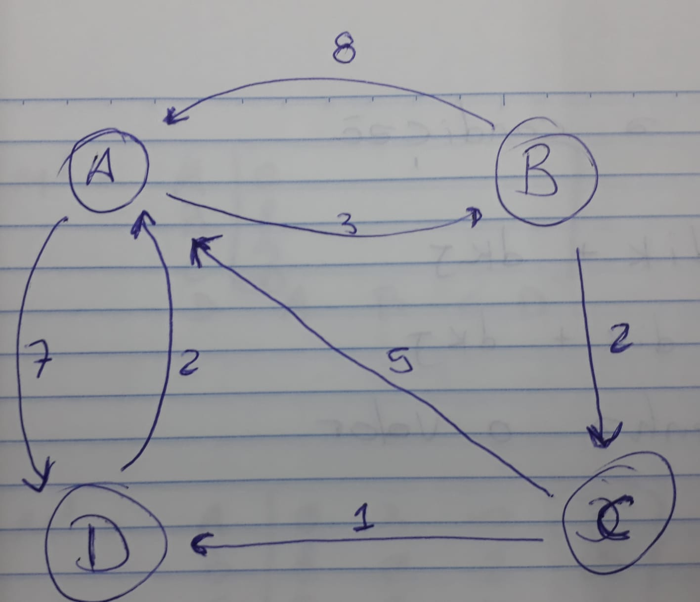
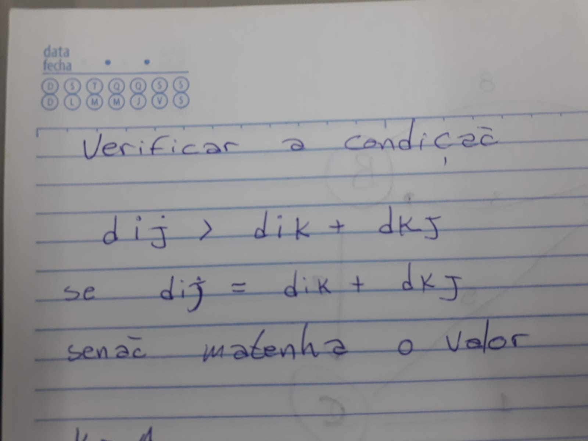
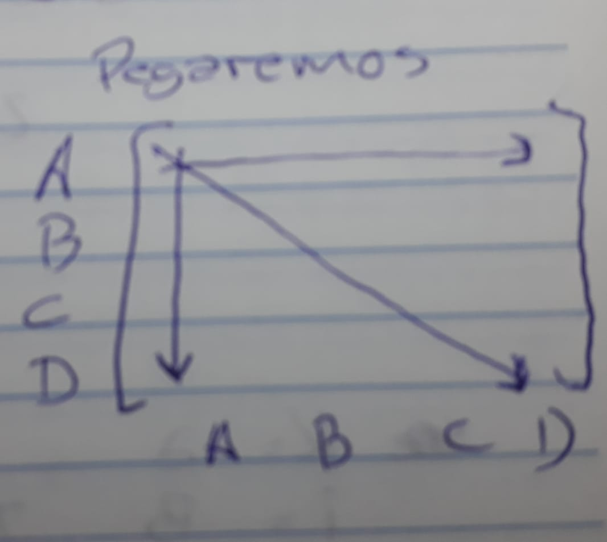
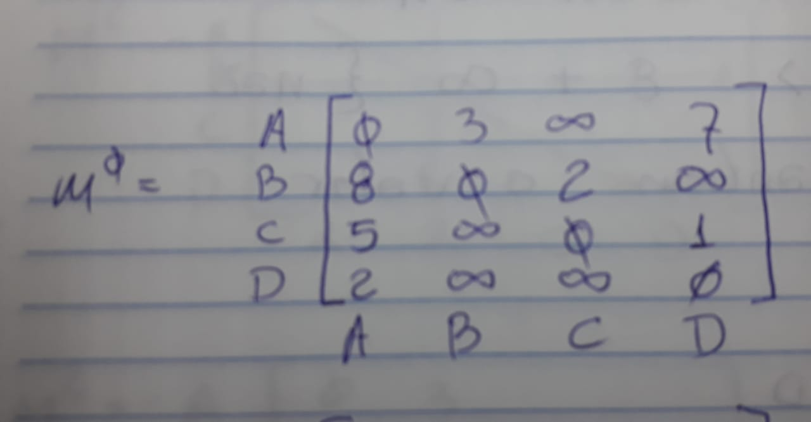
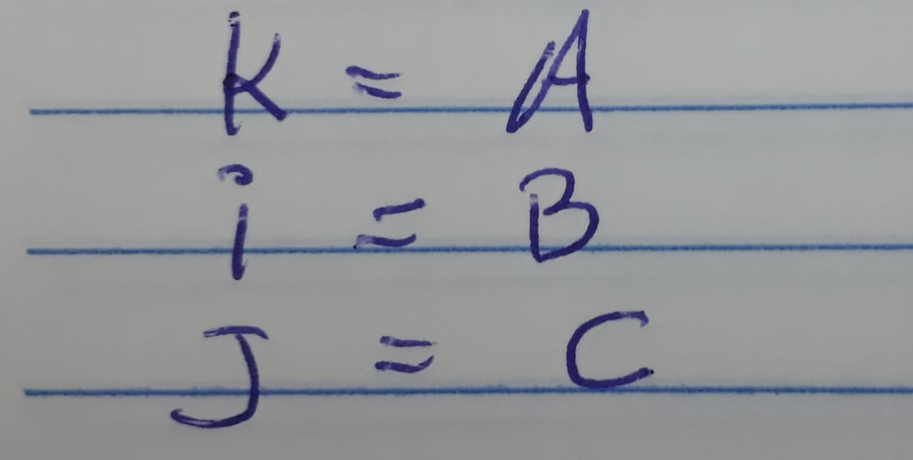
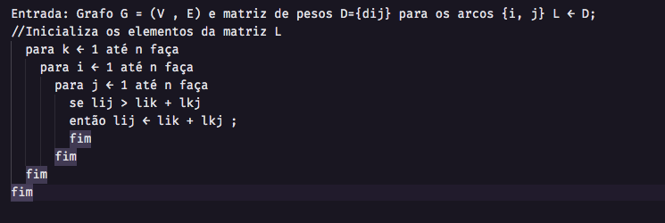

# Algoritmo de Floyd-Warshall

---

<!-- Speaker Notes -->

## Projeto desenvolvido pelos alunos:

- Adriano Henrique
- Arom Vinicius
- Eduardo Rosalin
<!-- Can have multiple on a slide -->

---

## Algoritmo de Floyd-Warshall

O algoritmo de Floyd-Warshall é um algoritmo de programação dinâmica utilizado para encontrar os caminhos mais curtos entre todos os pares de vértices em um grafo ponderado com arestas de peso positivo ou negativo.

<!-- Can also do a multiline
comment that will show in notes -->

---

## Algoritmo de Floyd-Warshall

O algoritmo funciona criando uma matriz de distâncias entre todos os pares de vértices, onde o elemento (i, j) dessa matriz representa a menor distância entre o vértice i e o vértice j. Inicialmente, essa matriz é preenchida com as distâncias das arestas do grafo. Em seguida, o algoritmo verifica se existe um caminho de i a j passando por um vértice k com distância menor do que a distância direta entre i e j. Se houver tal caminho, a distância entre i e j é atualizada com a distância do caminho i → k → j.

---

## Algoritmo de Floyd-Warshall

O algoritmo executa essa verificação para cada par de vértices (i, j) e para cada vértice k no grafo. O algoritmo atualiza a matriz de distâncias em cada iteração, de modo que a matriz final contém as distâncias mais curtas entre todos os pares de vértices.

---

## Algoritmo de Floyd-Warshall

O algoritmo de Floyd-Warshall tem uma complexidade de tempo de O(n^3), onde n é o número de vértices no grafo. Ele é útil em muitas aplicações, como encontrar o menor caminho entre dois pontos em um mapa ou otimizar rotas em uma rede de transporte.

---

## Grafo

## Exemplo: Grafo ponderado com arestas de peso

## Exemplo: Grafo ponderado com arestas de peso

---

### Steps

---

### Steps

---

### Steps

---

#### Pseudocódigo

##### Recursividade

---

### Onde é usado

Redes de transporte: O algoritmo de Floyd-Warshall pode ser aplicado para determinar as rotas mais curtas em uma rede de transporte, como um sistema de estradas, rotas de navegação marítima ou redes de transporte público

Grafos de dependência: O algoritmo de Floyd-Warshall também pode ser aplicado em grafos de dependência, onde os vértices representam tarefas e as arestas indicam dependências entre as tarefas. Ele pode ser usado para determinar a ordem de execução ótima das tarefas, minimizando o tempo total necessário para concluir todas as tarefas

---

### Conclusão

Modelagem de sistemas de roteamento: Em sistemas de roteamento, como roteadores de rede, o algoritmo de Floyd-Warshall pode ser usado para construir tabelas de roteamento que contêm informações sobre os caminhos mais curtos para diferentes destinos na rede.

Esses são apenas alguns exemplos de aplicação do algoritmo de Floyd-Warshall. Sua capacidade de calcular caminhos mais curtos entre todos os pares de vértices em um grafo ponderado o torna uma ferramenta versátil em várias áreas onde a otimização do caminho é relevante

---

## Fontes Bibiográficas

[wikipedia](https://pt.wikipedia.org/wiki/Algoritmo_de_Floyd-Warshall)
[techiedelight](https://www.techiedelight.com/pt/pairs-shortest-paths-floyd-warshall-algorithm/)
